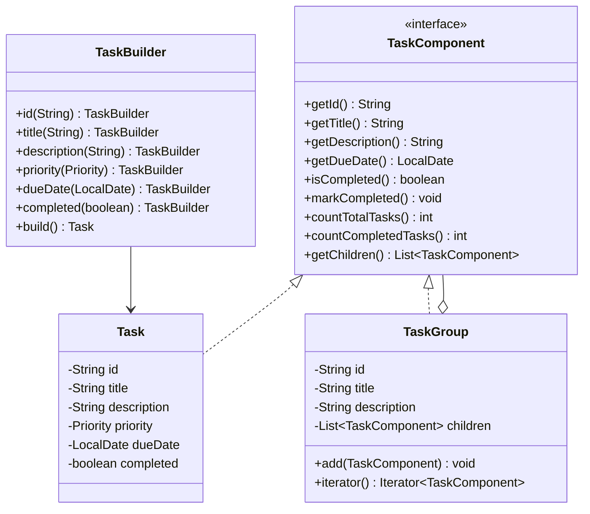
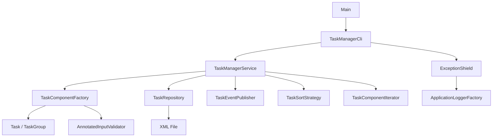

# Secure Task Manager

Secure Task Manager is a Java SE command-line app for managing project tasks.

It supports:

- creating task groups
- creating tasks
- listing tasks
- marking tasks or groups as completed
- saving the project to XML
- loading the project from XML

The project was built to show object-oriented design, design patterns, Java I/O, logging, testing, and secure programming.

## Requirements

- Java 17 or newer
- Maven

Check your setup:

```bash
java -version
mvn -version
```

## Run

From the project folder:

```bash
mvn compile exec:java
```

## Test

```bash
mvn test
```

Current test suite covers domain logic, factories, iterator traversal, sanitization, exception shielding, XML persistence, logging, service behavior, and optional patterns.

## How To Use

When the app starts, it shows this menu:

```text
1. List tasks
2. Create group
3. Create task
4. Mark completed
5. Save
6. Load
0. Exit
```

The app starts with one default root group:

```text
group-1 | Main Project
```

Use that id as the parent when creating the first groups or tasks.

Save files must use the `.xml` extension.

Example:

```text
tasks.xml
```

## Main Packages

```text
com.epicode.taskmanager
├── cli          command-line menu
├── domain       task model and composite structure
├── event        observer events
├── factory      object creation
├── iterator     custom tree iterator
├── logging      logging setup
├── persistence  XML save/load
├── security     sanitization and exception shielding
├── service      application use cases
└── strategy     task sorting strategies
```

## Design Patterns Used

### Factory

Implemented by:

- `TaskComponentFactory`
- `IdGenerator`
- `SequentialIdGenerator`

Reason:

Task and group creation is centralized. The rest of the app does not need to know how ids are generated or how input is prepared before object creation.

### Composite

Implemented by:

- `TaskComponent`
- `Task`
- `TaskGroup`

Reason:

A project can contain tasks and groups. Groups can contain more tasks and more groups. Composite allows the app to treat both simple tasks and nested groups through the same interface.

### Iterator

Implemented by:

- `TaskComponentIterator`
- `TaskGroup implements Iterable<TaskComponent>`

Reason:

The app can traverse a nested task tree without exposing the internal list structure. This is used by services and reports.

### Exception Shielding

Implemented by:

- `ExceptionShield`
- `OperationResult`
- `ApplicationException`
- `ValidationException`
- `PersistenceException`

Reason:

Users receive safe messages. Unexpected internal errors are not printed as stack traces in the user-facing flow.

### Builder

Implemented by:

- `TaskBuilder`

Reason:

Task creation has several fields. Builder makes construction clearer and is useful when loading completed tasks from XML.

### Strategy

Implemented by:

- `TaskSortStrategy`
- `DueDateSortStrategy`
- `PrioritySortStrategy`
- `TitleSortStrategy`

Reason:

The app can sort task lists in different ways without changing the service logic.

### Observer

Implemented by:

- `TaskEvent`
- `TaskEventType`
- `TaskEventListener`
- `TaskEventPublisher`

Reason:

The service can notify listeners when important actions happen, such as task creation, completion, save, and load. This makes it easy to add audit logs or UI updates later.

### Chain Of Responsibility

Implemented by:

- `TextValidationStep`
- `RequiredTextValidationStep`
- `ControlCharacterSanitizationStep`
- `TrimTextValidationStep`
- `BlankTextValidationStep`
- `MaxLengthValidationStep`

Reason:

Input validation is split into small steps. Each step handles one rule and passes the text to the next step.

## Technologies Used

### Collections

Used in `TaskGroup`, services, tests, and reports.

Example:

- `List<TaskComponent>` stores children in each group.

### Generics

Used in:

- `OperationResult<T>`
- `Iterator<TaskComponent>`
- `List<TaskComponent>`
- `Optional<TaskComponent>`

### Java I/O

Used in:

- `XmlTaskRepository`

The project is saved and loaded from XML files using Java standard APIs.

### Logging

Used in:

- `ApplicationLoggerFactory`
- `logging.properties`
- `Main`
- `ExceptionShield`

Logs are controlled through Java Util Logging.

### JUnit Testing

Used for unit tests across the project.

The command is:

```bash
mvn test
```

### Stream API And Lambdas

Used in:

- `TaskManagerService`

Examples:

- sorted task lists
- open tasks due before a date
- task summary reports

### Reflection

Used in:

- `AnnotatedInputValidator`

The validator reads fields marked with `@SanitizedText` at runtime and sanitizes them.

### Custom Annotations

Used in:

- `SanitizedText`

The factory uses annotated input records before creating tasks and groups.

## Security Choices

### Input Sanitization

Implemented by:

- `InputSanitizer`
- `AnnotatedInputValidator`
- `SanitizedText`
- validation chain classes

It trims input, removes unsafe control characters, rejects blank values, and limits text size.

### No Hardcoded Secrets

The app does not use credentials, tokens, API keys, or passwords.

### Controlled Exception Propagation

The CLI uses `ExceptionShield`.

Expected errors, like invalid input, return clear messages.

Unexpected errors return a generic safe message.

### XML Safety

The XML parser is configured with secure processing and disables external entity features.

This reduces XML-related risks such as external entity loading.

## Class Diagram



## Architecture Diagram



## Why These Choices

- CLI was chosen because the assignment asks for Java SE, and a command-line app keeps the focus on OOP and core Java.
- XML was chosen because Java SE has built-in XML APIs, so no extra persistence dependency is needed.
- Composite fits naturally because projects can contain nested groups and tasks.
- Factory keeps object creation in one place.
- Exception Shielding helps avoid crashes and stack traces for users.
- Strategy makes sorting easy to extend.
- Builder makes task construction easier to read and safer when there are many fields.
- Observer makes important service actions observable without coupling the service to a specific output.
- Chain of Responsibility keeps input validation small and easy to test.
- Reflection and custom annotations reduce repeated validation code in factories.
